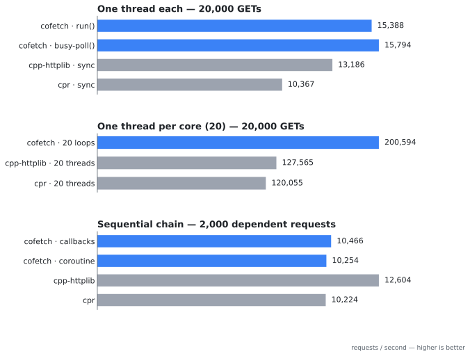

# cofetch: async HTTP client for C++.

[](https://github.com/SSARCandy/cofetch/actions/workflows/ci.yml)
[](https://codecov.io/gh/SSARCandy/cofetch)
[](https://ssarcandy.tw/cofetch)
[](LICENSE)


Requests **build as a chain** — setters flow off `request()` and the
HTTP verb fires the transfer, without blocking the thread:

```cpp
client
  .request("https://api.example.com/orders")
  .headers({"content-type: application/json"})
  .body(R"({"qty": 1})")
  .timeout(std::chrono::seconds(2))
  .post([](std::error_code ec, cofetch::Response res) {
    // transport errors in ec; HTTP status in res.http_code_
  });
```

Callbacks are the zero-overhead hot path, and any ASIO completion
token plugs into the same calls — `std::future`, `asio::deferred`,
`asio::as_tuple`. Cancellation composes the way it does everywhere
in asio: `asio::cancel_after(2s, token)` aborts an in-flight request.
On C++20, that includes coroutines: dependent requests in linear
code, no nesting:

```cpp
const auto user  = co_await client.async_get(api + "/user", asio::use_awaitable);
const auto posts = co_await client.async_post(api + "/posts", user.data_, asio::use_awaitable);
```

## Why cofetch

- **Header-only.** One file, nothing to build — bring libcurl (linked)
  and ASIO (include path), then `#include <cofetch.h>`.
- **Chainable syntax.** Build a request with setters, fire it with the
  HTTP verb — the same chain works with callbacks, futures, or
  coroutines.
- **ASIO-native.** Requests run on the `asio::io_context`. Drive it
  with `run()`, or `poll()` it from a busy loop that must never block
  (the trading hot path this library grew out of).
- **libcurl underneath.** HTTP/1.1 and HTTP/2 multiplexing, TLS,
  compression, connection pooling, redirects. For anything cofetch
  does not wrap, `.curl([](CURL* h) { ... })` exposes the raw handle
  per request.
- **C++17-friendly.** The full API — chains, callbacks, futures,
  `deferred` — works on C++17; C++20 adds the `co_await` interface.

## Benchmarks

Same workload for every client — 20,000 GETs against a local nginx.
[cpr](https://github.com/libcpr/cpr) and
[cpp-httplib](https://github.com/yhirose/cpp-httplib) are synchronous
(one request per thread); cofetch keeps 100 in flight on a single
thread, and wins every scenario: **+35%** single-thread throughput
over the fastest sync client, **+31%** with one event loop per core
against equal-sized thread pools, **+16%** on sequential chains driven
from a busy-poll loop.

<picture>
  <source media="(prefers-color-scheme: dark)" srcset="docs/benchmark-dark.svg">
  
</picture>

Exact numbers, environment, and how to reproduce:
[bench/README.md](https://github.com/SSARCandy/cofetch/tree/main/bench).

## Quick start

```cpp
#include <asio.hpp>
#include <iostream>
#include <cofetch.h>

int main() {
  asio::io_context io;
  cofetch::Client client(io);

  client
    .request("https://postman-echo.com/post")
    .body("hello=cofetch")
    .post([](std::error_code ec, cofetch::Response res) {
      if (ec) {
        std::cerr << ec.message() << "\n";  // DNS, TLS, timeout...
        return;
      }
      std::cout << res.http_code_ << " " << res.data_ << "\n";
    });

  io.run();  // or io.poll() from your own loop — see examples/example03.cpp
}
```

On C++20 the same flow reads linearly with `co_await`
(`examples/example02.cpp`).

Prefer a plain value? `cofetch::Request` holds the same fields and
fires later via `client.async_perform(std::move(req), token)`.

## Installation

Requirements: a C++17 compiler (the `co_await` interface needs C++20),
libcurl ≥ 7.80 (dev headers), and
[standalone ASIO](https://github.com/chriskohlhoff/asio) — or
Boost.Asio, via `-DCOFETCH_USE_BOOST_ASIO=ON` (`cofetch::error_code`
then follows the flavor: `std::` or `boost::system::`).

### CMake (FetchContent)

```cmake
include(FetchContent)
FetchContent_Declare(cofetch
    GIT_REPOSITORY https://github.com/SSARCandy/cofetch.git
    GIT_TAG main)
FetchContent_MakeAvailable(cofetch)
target_link_libraries(your_app PRIVATE cofetch::cofetch)
```

cofetch does not impose an ASIO on consumers: point it at yours (any
include path providing `<asio.hpp>`), or enable the vendored submodule
with `-DCOFETCH_USE_VENDORED_ASIO=ON`.

### Manual

Copy `include/cofetch.h`, add asio to your include path, link `libcurl`.

## What cofetch is not

- **Not a server.** Client only. For a server (or a tiny zero-dependency
  client), use [cpp-httplib](https://github.com/yhirose/cpp-httplib).
- **Not thread-safe.** One `Client` per `io_context` thread by design —
  no locks on the hot path. The client must outlive its in-flight
  requests.

## Development

```bash
git submodule update --init          # asio + googletest (dev only)
./build.sh -t                        # Debug build + tests + coverage
./linter.sh                          # clang-format check (v19 pinned in CI)
doxygen Doxyfile                     # API reference -> docs/api/html/
```

CI runs the linter, the offline test suite (local echo server, no
external endpoints) on Linux gcc/clang and macOS, and a C++17 consumer
smoke build.

## License

[MIT](LICENSE)
